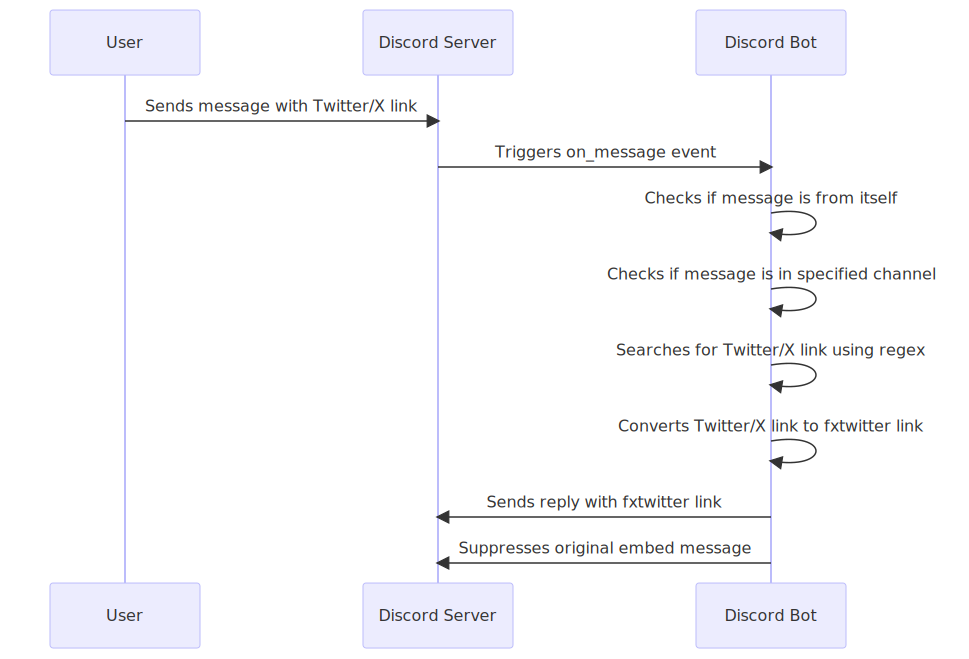
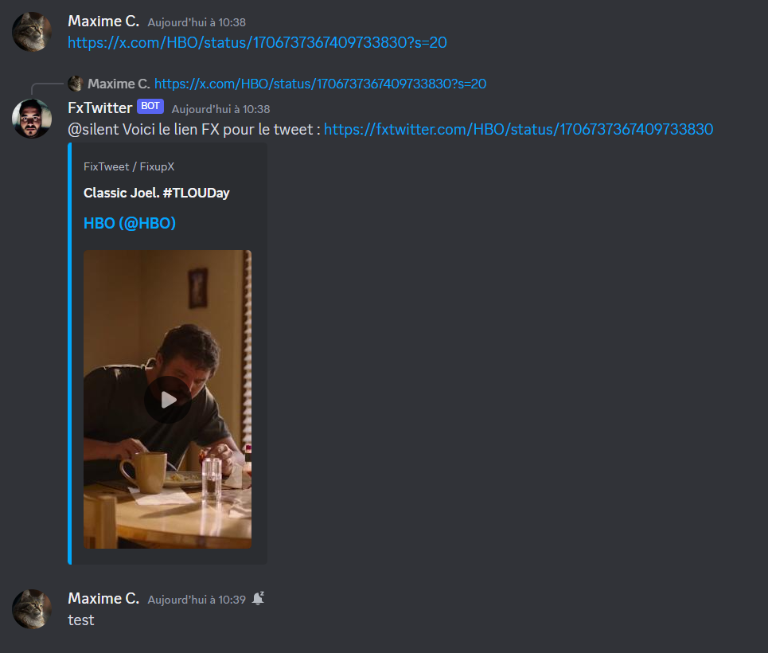

# Amélioration des Embeds Twitter/X sur Discord via Azure Functions

## Table des Matières
1. [Problème Identifié](#problème-identifié)
2. [Architecture de la Solution](#architecture-de-la-solution)
3. [Mise en œuvre](#mise-en-œuvre)
4. [Évaluation](#évaluation)
5. [Test de Résilience](#test-de-résilience)
6. [Screenshots et Liens Actifs](#screenshots-et-liens-actifs)
7. [Références](#références)

## Problème Identifié
Les embeds Twitter/X sur Discord ont longtemps été problématiques, rendant difficile la visualisation et l'interaction avec les tweets. Ce projet vise à fournir une solution automatisée pour transformer les liens Twitter/X en un format plus utilisable (fxtwitter).

## Architecture de la Solution
Cette solution utilise Azure Functions pour héberger un bot Discord qui convertit les liens Twitter/X, Azure Logic Apps pour orchestrer le workflow, et Azure Cosmos DB pour stocker les données nécessaires.
### Diagramme d'Architecture

## Mise en œuvre
### Étapes d'Implémentation
1. Développement du bot Discord en local.
2. Déploiement du bot sur Azure Functions.
3. Configuration d'Azure Logic Apps pour orchestrer le workflow.
4. Configuration d'Azure Cosmos DB pour le stockage des données.
### Défis Rencontrés et Solutions
- Défi 1: Faire en sorte que ça marche
- Solution 1: ça marche :thumbsup:
- Défi 2: 
- Solution 2:

## Évaluation
### Efficacité de la Solution
La solution a réussi à transformer les liens Twitter/X automatiquement, améliorant ainsi l'expérience utilisateur sur Discord.
### Améliorations Possibles
Le bot pourrait ne pas se limiter qu'à un seul channel

## Test de Résilience
### Processus de Test
Un ensemble d'utilisateur qui envoie simultanement des messages contenant un lien vers 

## Screenshots et Liens Actifs

## Références
- [Azure Functions Overview](https://docs.microsoft.com/en-us/azure/azure-functions/functions-overview)
- [Azure Logic Apps Overview](https://docs.microsoft.com/en-us/azure/logic-apps/logic-apps-overview)

## Annexes

